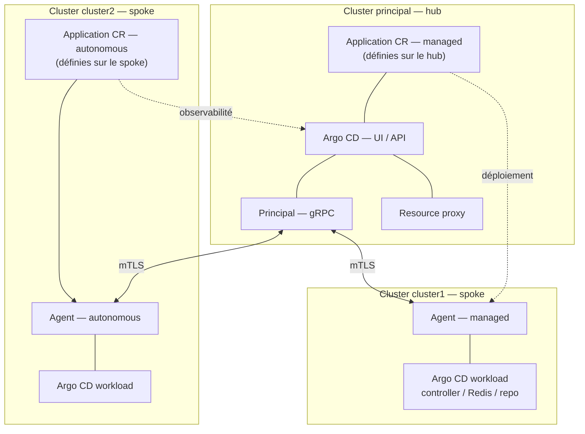
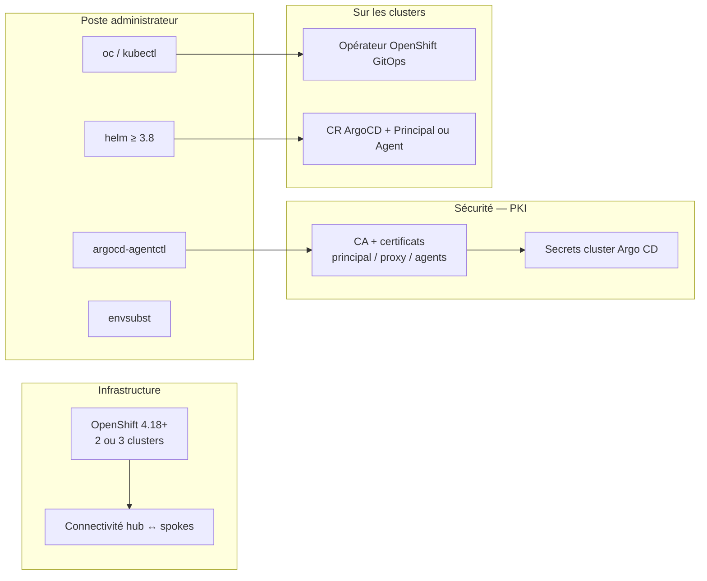

# Guide étape par étape — Argo CD Agent (PoV multicluster)

Ce document **complète** le [`README.md`](README.md) en décrivant **chaque tâche** : objectif, contexte (quel cluster), actions manuelles détaillées, et **référence** vers l’automatisation déjà présente dans le dépôt (scripts, `*.template`).

**Architecture visée**

| Cluster | Rôle |
|---------|------|
| **principal** | Hub : Argo CD + composant **Principal** (UI/API centrale) |
| **cluster1** | Spoke : **Agent managed** — les `Application` sont définies sur le hub |
| **cluster2** | Spoke : **Agent autonomous** — les `Application` sont définies sur le spoke |

---

## Comment lire ce guide

- Chaque **tâche** a un identifiant **`Txx`** pour le suivi (checklist interne).
- La colonne **Automatisation** indique le fichier ou la commande du dépôt qui regroupe cette étape.
- Les **commandes manuelles** reprennent la logique des scripts : vous pouvez les exécuter à la main pour comprendre ou dépanner.

---

## Prérequis d’environnement

### Clusters OpenShift

Ce guide part du principe que vous disposez de **deux ou trois clusters OpenShift**, en version **4.18 minimum**. Cette version sert de référence dans les procédures Red Hat / PoV Argo CD Agent ; vérifiez toutefois la **matrice de compatibilité** officielle pour votre canal **OpenShift GitOps** (et ajustez si votre organisation impose une version différente).

| Scénario | Nombre de clusters | Couverture |
|----------|-------------------|------------|
| PoV **réduit** | **2** (principal + un spoke) | Suffisant pour valider **un** mode à la fois : **managed** *ou* **autonomous** (en réinstallant l’agent ou en changeant de spoke). |
| PoV **complet** (ce document) | **3** (principal + cluster1 + cluster2) | **Managed** sur cluster1 et **autonomous** sur cluster2 en parallèle. |

**Droits** : accès **cluster-admin** (ou équivalent) sur chaque cluster concerné.

**Réseau** : connectivité **bidirectionnelle** entre le hub et chaque spoke pour le **Principal** (gRPC / HTTPS selon votre exposition : Routes, LB, pare-feu). Sans chemin réseau fiable, l’agent ne pourra pas joindre le Principal.

---

### Vue d’ensemble — ce que l’on met en place

Le schéma ci-dessous résume l’architecture cible : un **hub** centralise l’interface Argo CD et le **Principal** ; chaque **spoke** exécute un **Agent** (et une instance Argo CD « workload » locale) qui synchronise les applications avec le hub selon le mode (**managed** = vérité sur le hub, **autonomous** = vérité sur le spoke).



*Légende* : le **Principal** authentifie les agents en **mTLS**. En **managed**, les `Application` sont créées sur le **principal** (`MCR`) et synchronisées vers le spoke. En **autonomous**, les `Application` sont créées sur le **spoke** (`ACR` en haut du bloc cluster2, au-dessus de l’agent) puis **remontées** vers l’UI du hub pour l’observabilité. Les nœuds **Application CR** sont séparés des **workloads** pour éviter tout chevauchement à l’affichage.

---

### Ce qui est nécessaire (récapitulatif)



En pratique, cela se traduit par le tableau suivant (détaillé en **Phase 0** et suivantes).

| Domaine | Nécessaire pour |
|--------|------------------|
| **2 ou 3 clusters** OCP ≥ 4.18 | Héberger hub et spoke(s) |
| **Réseau** ouvert hub ↔ spokes | Jointure Principal ↔ Agent |
| **`oc`** + contextes distincts | Appliquer les manifests sur le bon cluster |
| **`argocd-agentctl`** (ou **cert-manager** + scripts) | mTLS, secrets `cluster-*`, certificats clients |
| **`helm`** + repo `openshift-helm-charts` | Chart `redhat-argocd-agent` sur les spokes |
| **`envsubst`** + `envsubst.env` | Générer les `values` Helm et certains YAML depuis les `*.template` |
| **OpenShift GitOps** (opérateur) | CR `ArgoCD` avec Principal ou workload agent |

---

## Phase 0 — Préparation de l’environnement local

### T01 — Contextes `oc` distincts

**Objectif** : pouvoir cibler explicitement le hub et chaque spoke sans ambiguïté.

**Pourquoi** : `argocd-agentctl` et les scripts utilisent `--principal-context` et `--agent-context` ; des noms courts (`principal`, `cluster1`, `cluster2`) évitent les erreurs.

**Actions**

1. Connectez-vous à chaque cluster (`oc login …`).
2. Renommez les contextes :

   ```bash
   oc config get-contexts
   oc config rename-context <ancien-nom-principal> principal
   oc config rename-context <ancien-nom-cluster1> cluster1
   oc config rename-context <ancien-nom-cluster2> cluster2
   ```

**Vérification** : `oc config get-contexts` affiche bien `principal`, `cluster1`, `cluster2`.

**Automatisation** : aucune (configuration poste).

---

### T02 — Outils installés

**Objectif** : disposer des binaires attendus par le PoV.

**Pourquoi** : PKI, Helm et substitution de variables sont nécessaires à l’installation.

| Outil | Rôle |
|-------|------|
| `oc` / `kubectl` | Appliquer les manifests |
| `argocd-agentctl` | PKI et enregistrement des agents (option A) — [Content Gateway OpenShift GitOps](https://developers.redhat.com/content-gateway/rest/browse/pub/cgw/openshift-gitops/) ou [GitHub](https://github.com/argoproj-labs/argocd-agent/releases) |
| `helm` ≥ 3.8 | Installation du chart `redhat-argocd-agent` |
| `envsubst` | Remplir les fichiers `*.template` (souvent paquet `gettext`) |

**Automatisation** : les valeurs Helm et cert-manager utilisent [`envsubst.env.example`](envsubst.env.example) — copie en `envsubst.env` puis `set -a && source envsubst.env && set +a`.

---

### T03 — Dépôt Helm OpenShift

**Objectif** : pouvoir installer `openshift-helm-charts/redhat-argocd-agent`.

**Actions**

```bash
helm repo add openshift-helm-charts https://charts.openshift.io/
helm repo update
```

**Vérification** : `helm search repo redhat-argocd-agent` liste le chart.

**Automatisation** : indiquée dans [`README.md`](README.md) (Étape 0).

---

### T04 — Fichier de variables `envsubst.env`

**Objectif** : centraliser `PRINCIPAL_ROUTE_HOST`, `RESOURCE_PROXY_SERVER`, etc.

**Pourquoi** : les modèles `*.template` utilisent `${VAR}` ; une seule source de vérité limite les fautes de frappe.

**Actions**

1. `cp envsubst.env.example envsubst.env`
2. Éditer `envsubst.env` :
   - **`PRINCIPAL_ROUTE_HOST`** : hôte **seul** de la Route du Principal (sans `https://`), obtenu après T12 avec `oc get route -n argocd --context principal`.
   - **`RESOURCE_PROXY_SERVER`** : `host:port` du service **resource-proxy** sur le principal (ex. `…resource-proxy.argocd.svc.cluster.local:9090`), obtenu avec `oc get svc -n argocd --context principal`.

**Vérification** : `set -a && source envsubst.env && set +a && echo "$PRINCIPAL_ROUTE_HOST"`

**Automatisation** : même fichier pour `envsubst < …template | helm …`.

---

## Phase 1 — Cluster **principal** (hub)

*Toutes les commandes ci-dessous : contexte **`principal`** (`oc config use-context principal`).*

---

### T10 — Installer l’opérateur OpenShift GitOps (Subscription)

**Objectif** : déployer l’opérateur qui gère les ressources `ArgoCD` et les composants GitOps.

**Pourquoi** : sans CSV **Succeeded**, les CR `ArgoCD` ne seront pas pris en charge correctement.

**Actions**

```bash
oc config use-context principal
oc apply -k principal/operator
```

Attendre que le **ClusterServiceVersion** soit en phase `Succeeded` :

```bash
oc get csv -n openshift-gitops-operator -w
```

**Vérification** : pods `Running` dans `openshift-gitops-operator`.

**Automatisation** : [`principal/operator/`](principal/operator/) (Subscription + OperatorGroup + Namespace).

---

### T11 — Créer les namespaces `argocd` et `managed-cluster`

**Objectif** : isoler l’instance Argo CD / Principal et héberger les `Application` « managed » du hub.

**Pourquoi** : `managed-cluster` est déclaré dans `spec.sourceNamespaces` de l’Argo CD hub pour le modèle *Apps in any namespace*.

**Actions**

```bash
oc apply -k principal/namespaces
```

**Vérification** : `oc get ns argocd managed-cluster`.

**Automatisation** : [`principal/namespaces/`](principal/namespaces/).

---

### T12 — Créer l’instance Argo CD avec le **Principal** activé

**Objectif** : déployer l’UI/API Argo CD sur le hub et le pod **Principal** (point de terminaison gRPC pour les agents).

**Pourquoi** : le `spec.controller.enabled: false` évite un second contrôleur sur le hub ; le Principal orchestre la synchro avec les agents.

**Actions**

```bash
oc apply -k principal/argocd
```

**Vérification** : routes et pods apparaissent dans `argocd` ; noter la **Route** du Principal pour `PRINCIPAL_ROUTE_HOST` (T04).

```bash
oc get route -n argocd
oc get pods -n argocd
```

**Automatisation** : [`principal/argocd/argocd-principal.yaml`](principal/argocd/argocd-principal.yaml).

**Note** : tant que la PKI (Phase 2) n’est pas prête, le pod Principal peut rester en erreur — c’est attendu.

---

### T13 — Autoriser les namespaces sources sur l’`AppProject` `default`

**Objectif** : permettre à Argo CD de gérer des `Application` dans `managed-cluster` (et `argocd` si besoin).

**Pourquoi** : sans `sourceNamespaces`, les `Application` hors namespace de l’instance peuvent être refusées.

**Actions** (équivalent au script) :

```bash
oc patch appproject default -n argocd --type=merge \
  -p '{"spec":{"sourceNamespaces":["managed-cluster","argocd"]}}'
```

Ou exécuter :

```bash
chmod +x principal/appproject/patch-default-source-namespaces.sh
./principal/appproject/patch-default-source-namespaces.sh argocd
```

**Vérification** : `oc get appproject default -n argocd -o yaml | grep -A5 sourceNamespaces`

**Automatisation** : [`principal/appproject/patch-default-source-namespaces.sh`](principal/appproject/patch-default-source-namespaces.sh).

---

### T14 — Secret Redis pour le Principal

**Objectif** : fournir le mot de passe Redis attendu par le déploiement Principal (souvent aligné sur le secret initial Argo CD).

**Pourquoi** : le Principal s’appuie sur Redis pour certaines fonctions ; sans secret `argocd-redis` cohérent, les pods peuvent échouer.

**Actions manuelles** (logique du script) :

```bash
PW=$(oc get secret argocd-redis-initial-password -n argocd -o jsonpath='{.data.admin\.password}' | base64 -d)
oc create secret generic argocd-redis -n argocd --from-literal=auth="$PW" --dry-run=client -o yaml | oc apply -f -
# Puis redémarrer le déploiement Principal si nécessaire
oc rollout restart deployment -n argocd -l app.kubernetes.io/name=argocd-agent-principal
```

**Vérification** : `oc get secret argocd-redis -n argocd` ; pod Principal `Running`.

**Automatisation** : [`principal/scripts/bootstrap-redis-secret-principal.sh`](principal/scripts/bootstrap-redis-secret-principal.sh).

---

## Phase 2 — PKI et enregistrement des agents (cluster1 + cluster2)

Deux chemins : **A — argocd-agentctl** (recommandé PoV) ou **B — cert-manager** (optionnel). Les tâches ci-dessous détaillent **A** ; en fin de phase, référence vers **B**.

---

### Phase 2A — PKI avec `argocd-agentctl` (manuel, commande par commande)

*Contexte principal : `--principal-context principal` ; pour les agents : `--agent-context cluster1` ou `cluster2`.*

> **Prérequis spokes (T25 / T26)** : les commandes `pki propagate` et `pki issue agent …` créent des secrets dans le namespace **`argocd` sur chaque cluster agent**. Plus loin dans le guide, ce namespace n’apparaît sur le spoke qu’en **T30** (cluster1, Phase 3) ou à l’**équivalent Phase 5** pour cluster2 — si vous suivez les phases dans l’ordre strict, T25/T26 arrivent **avant** ces étapes, d’où l’erreur `namespaces "argocd" not found`. Créez au minimum les namespaces sur les spokes **avant** T25 (et avant T26 pour cluster2). Si vous utilisez [`principal/scripts/bootstrap-argocd-agentctl.sh`](principal/scripts/bootstrap-argocd-agentctl.sh), ce prérequis est **automatisé** au début du script.
>
> ```bash
> oc config use-context cluster1
> oc apply -k cluster1/namespaces
> oc config use-context cluster2
> oc apply -k cluster2/namespaces
> ```
>
> Vérifications : `oc get ns argocd --context cluster1` et `oc get ns argocd --context cluster2`.  
> *Note* : `oc project argocd` n’utilise que le **contexte courant** ; il ne prouve pas que `argocd` existe sur le cluster référencé par le contexte `cluster1` du kubeconfig.

#### T20 — Initialiser la CA (Principal)

**Objectif** : créer le secret `argocd-agent-ca` sur le principal.

**Commande**

```bash
argocd-agentctl pki init --principal-context principal --principal-namespace argocd
```

**Vérification** : `oc get secret argocd-agent-ca -n argocd --context principal`

---

#### T21 — Certificat serveur du Principal (gRPC)

**Objectif** : secret `argocd-agent-principal-tls` pour le service gRPC exposé (Route + SAN internes).

**Commande** (adapter les `--dns` : host Route + DNS cluster du service)

```bash
argocd-agentctl pki issue principal \
  --principal-context principal \
  --principal-namespace argocd \
  --dns "localhost,argocd-agent-principal.argocd.svc.cluster.local,${PRINCIPAL_ROUTE_HOST}" \
  --upsert
```

**Vérification** : secret `argocd-agent-principal-tls` présent.

---

#### T22 — Certificat du **resource-proxy**

**Objectif** : secret `argocd-agent-resource-proxy-tls` pour que l’UI Argo CD dialogue avec le proxy de ressources.

**Commande** (adapter `--dns` au nom réel du service resource-proxy, voir `oc get svc -n argocd`)

```bash
argocd-agentctl pki issue resource-proxy \
  --principal-context principal \
  --principal-namespace argocd \
  --dns "localhost,<FQDN-du-service-resource-proxy>" \
  --upsert
```

**Vérification** : secret `argocd-agent-resource-proxy-tls` présent.

---

#### T23 — Clé JWT du Principal

**Objectif** : secret `argocd-agent-jwt` pour la signature des jetons côté Principal.

**Commande**

```bash
argocd-agentctl jwt create-key \
  --principal-context principal \
  --principal-namespace argocd \
  --upsert
```

**Vérification** : `oc get secret argocd-agent-jwt -n argocd --context principal`

---

#### T24 — Enregistrer l’agent **cluster1** (secret cluster Argo CD)

**Objectif** : créer sur le principal un secret `cluster-cluster1` étiqueté comme cluster distant, pointant vers le resource-proxy.

**Commande** (`RESOURCE_PROXY_SERVER` = `host:port`, ex. `…:9090`)

```bash
argocd-agentctl agent create cluster1 \
  --principal-context principal \
  --principal-namespace argocd \
  --resource-proxy-server "${RESOURCE_PROXY_SERVER}"
```

**Vérification** : `oc get secret cluster-cluster1 -n argocd --context principal` (on ne peut pas combiner un **nom** de ressource et un sélecteur `-l` avec `oc get`). Pour lister tous les secrets « cluster » : `oc get secret -n argocd --context principal -l argocd.argoproj.io/secret-type=cluster`.

---

#### T25 — Propager la CA vers **cluster1** et émettre le certificat client

**Objectif** : sur cluster1, secrets `argocd-agent-ca` (sans clé privée de CA côté spoke selon flux) et `argocd-agent-client-tls` pour le mTLS.

**Commandes**

```bash
argocd-agentctl pki propagate \
  --principal-context principal \
  --agent-context cluster1 \
  --principal-namespace argocd \
  --agent-namespace argocd

argocd-agentctl pki issue agent cluster1 \
  --principal-context principal \
  --agent-context cluster1 \
  --principal-namespace argocd \
  --agent-namespace argocd \
  --upsert
```

**Vérification** (contexte cluster1) : `oc get secrets -n argocd | grep argocd-agent`

---

#### T26 — Répéter pour l’agent **cluster2**

**Objectif** : même logique que T24–T25 avec le nom logique `cluster2`.

**Commandes**

```bash
argocd-agentctl agent create cluster2 \
  --principal-context principal \
  --principal-namespace argocd \
  --resource-proxy-server "${RESOURCE_PROXY_SERVER}"

argocd-agentctl pki propagate \
  --principal-context principal \
  --agent-context cluster2 \
  --principal-namespace argocd \
  --agent-namespace argocd

argocd-agentctl pki issue agent cluster2 \
  --principal-context principal \
  --agent-context cluster2 \
  --principal-namespace argocd \
  --agent-namespace argocd \
  --upsert
```

**Automatisation des T20–T26** : tout enchaîner avec [`principal/scripts/bootstrap-argocd-agentctl.sh`](principal/scripts/bootstrap-argocd-agentctl.sh) après avoir exporté `PRINCIPAL_ROUTE_HOST`, `RESOURCE_PROXY_SERVER`, `PRINCIPAL_CTX`, `CLUSTER1_CTX`, `CLUSTER2_CTX`. Le script commence par appliquer `cluster1/namespaces` et `cluster2/namespaces` (prérequis PKI sur les spokes).

---

### Phase 2B — PKI avec **cert-manager** (aperçu)

**Objectif** : même état final des secrets, via l’opérateur cert-manager sur le principal.

**Étapes résumées** (détail dans [`README.md`](README.md) — Option B) :

1. Créer la CA (openssl) et le secret TLS `argocd-agent-ca` dans `argocd`.
2. Déployer `Issuer` + `Certificate` (`oc apply -k principal/cert-manager` après génération du certificat principal avec  
   `envsubst < principal/cert-manager/certificate-principal-tls.yaml.template | oc apply -f -`).
3. Attendre `READY` sur les ressources `Certificate`.
4. Créer `argocd-agent-jwt` (souvent via `argocd-agentctl jwt create-key` seul).
5. Construire les secrets `cluster-cluster1` / `cluster-cluster2` : [`principal/scripts/create-cluster-secret-certmanager.sh`](principal/scripts/create-cluster-secret-certmanager.sh).
6. Exporter vers les spokes : [`principal/scripts/export-certmanager-secrets-to-spoke.sh`](principal/scripts/export-certmanager-secrets-to-spoke.sh).

---

## Phase 3 — Cluster **cluster1** (agent **managed**)

*Contexte : **`cluster1`**.*

---

### T30 — Opérateur, namespace, Argo CD « workload »

**Objectif** : installer OpenShift GitOps sur le spoke et une instance Argo CD **sans serveur UI** (Redis + repo-server + application-controller locaux).

**Pourquoi** : l’agent pilote le contrôleur local ; l’UI reste sur le principal.

**Note** : si vous avez déjà appliqué `cluster1/namespaces` avant la PKI (prérequis T25), la ligne correspondante ci‑dessous est **idempotente** (aucun changement).

**Actions**

```bash
oc config use-context cluster1
oc apply -k cluster1/operator
# Attendre CSV Succeeded
oc apply -k cluster1/namespaces
oc apply -k cluster1/argocd
```

**Vérification** : pods `argocd` dans `argocd` sur cluster1 (pas besoin de Route serveur).

**Automatisation** : [`cluster1/operator`](cluster1/operator), [`cluster1/argocd`](cluster1/argocd).

---

### T31 — Secret Redis sur le spoke

**Objectif** : même principe que T14 pour l’instance Argo CD locale.

**Automatisation** : [`cluster1/scripts/bootstrap-redis-secret-agent.sh`](cluster1/scripts/bootstrap-redis-secret-agent.sh).

---

### T32 — NetworkPolicy Agent → Redis

**Objectif** : autoriser le trafic du pod Agent vers Redis (contournement des politiques par défaut souvent trop strictes).

**Actions** : `oc apply -k cluster1/networkpolicy` puis vérifier les labels Redis/Agent si besoin.

**Automatisation** : [`cluster1/networkpolicy/`](cluster1/networkpolicy/).

---

### T33 — Installer le chart Helm **managed**

**Objectif** : déployer le pod **Agent** en mode `managed`, relié à l’URL HTTPS du Principal.

**Actions** (avec variables chargées depuis `envsubst.env`) :

```bash
set -a && source envsubst.env && set +a
envsubst < cluster1/helm/values-managed.yaml.template | \
  helm install argocd-agent-managed openshift-helm-charts/redhat-argocd-agent \
    --kube-context cluster1 \
    -f -
```

**Vérification** : pod agent `Running` ; pas d’erreurs de connexion au Principal dans les logs.

**Automatisation** : modèle [`cluster1/helm/values-managed.yaml.template`](cluster1/helm/values-managed.yaml.template).

---

## Phase 4 — Validation **managed**

### T40 — Déployer une `Application` depuis le **principal**

**Objectif** : prouver que le hub impose la spec et que **cluster1** exécute le déploiement cible.

**Actions** (contexte **principal**) :

```bash
oc apply -f principal/applications/sample-application-managed-cluster1.yaml
```

**Vérification** : sur le principal, `Application` `sample-managed-cluster1` dans `managed-cluster` ; statut **Synced** / **Healthy**. Sur cluster1, ressources du chart dans `default`.

**Détail** : [`docs/validation-applications.md`](docs/validation-applications.md).

---

## Phase 5 — Cluster **cluster2** (agent **autonomous**)

*Contexte : **`cluster2`**. Même enchaînement que Phase 3 (T30–T32), puis Helm en mode **autonomous**.*

### T50 — Base OpenShift GitOps + Argo CD workload + Redis + NetworkPolicy

Voir T30–T32 en remplaçant `cluster1` par `cluster2` et les chemins `cluster2/…`. Si `cluster2/namespaces` a déjà été appliqué avant T26 (prérequis PKI), l’étape « namespaces » reste **idempotente**.

---

### T51 — Helm **autonomous**

**Objectif** : agent dont la source de vérité des `Application` est le **spoke**.

**Actions**

```bash
set -a && source envsubst.env && set +a
envsubst < cluster2/helm/values-autonomous.yaml.template | \
  helm install argocd-agent-autonomous openshift-helm-charts/redhat-argocd-agent \
    --kube-context cluster2 \
    -f -
```

**Automatisation** : [`cluster2/helm/values-autonomous.yaml.template`](cluster2/helm/values-autonomous.yaml.template).

---

## Phase 6 — Validation **autonomous**

### T60 — Créer l’`Application` sur **cluster2**

**Objectif** : démontrer le mode autonomous (`destination.server: https://kubernetes.default.svc`).

**Actions** (contexte **cluster2**) :

```bash
oc apply -f cluster2/applications/sample-application-autonomous-cluster2.yaml --context cluster2
```

**Vérification** : statut **Synced** sur cluster2 ; visibilité depuis l’UI du principal selon le comportement du mode autonomous.

**Détail** : [`docs/validation-applications.md`](docs/validation-applications.md).

---

## Tableau récapitulatif des tâches

| ID | Tâche | Cluster |
|----|--------|---------|
| T01–T04 | Préparation (contextes, outils, Helm, `envsubst.env`) | Local |
| T10–T14 | Opérateur, namespaces, Argo CD Principal, AppProject, Redis | principal |
| T20–T26 | PKI `argocd-agentctl` + agents cluster1 & cluster2 (namespaces `argocd` sur les spokes requis avant T25/T26 — voir Phase 2A ; le script `bootstrap-argocd-agentctl.sh` les crée) | principal + cluster1 + cluster2 |
| T30–T33 | Spoke managed (opérateur, Argo CD, NP, Helm managed) | cluster1 |
| T40 | Application de test managed | principal → cluster1 |
| T50–T51 | Spoke autonomous + Helm autonomous | cluster2 |
| T60 | Application de test autonomous | cluster2 |

---

## Équivalence « tout en script »

| Zone | Script / ressource regroupée |
|------|------------------------------|
| PKI + agents | [`principal/scripts/bootstrap-argocd-agentctl.sh`](principal/scripts/bootstrap-argocd-agentctl.sh) |
| Redis principal | [`principal/scripts/bootstrap-redis-secret-principal.sh`](principal/scripts/bootstrap-redis-secret-principal.sh) |
| Redis spokes | [`cluster1/scripts/bootstrap-redis-secret-agent.sh`](cluster1/scripts/bootstrap-redis-secret-agent.sh), [`cluster2/scripts/bootstrap-redis-secret-agent.sh`](cluster2/scripts/bootstrap-redis-secret-agent.sh) |
| AppProject | [`principal/appproject/patch-default-source-namespaces.sh`](principal/appproject/patch-default-source-namespaces.sh) |
| Cert-manager (optionnel) | [`create-cluster-secret-certmanager.sh`](principal/scripts/create-cluster-secret-certmanager.sh), [`export-certmanager-secrets-to-spoke.sh`](principal/scripts/export-certmanager-secrets-to-spoke.sh) |

Pour la procédure condensée et les liens externes, se reporter au [`README.md`](README.md).

---

*Version anglaise (US) : [`step-by-step.md`](step-by-step.md).*
