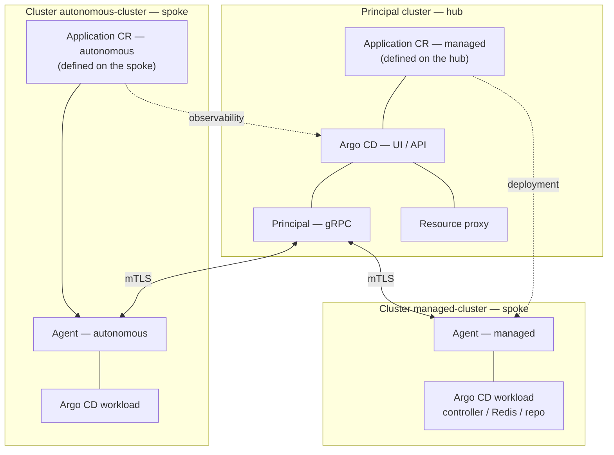

# Step-by-step guide — Argo CD Agent (multicluster PoV)

This document **complements** [`README.md`](README.md) by describing **each task**: goal, context (which cluster), detailed manual actions, and **reference** to the automation already in the repository (scripts, `*.template`).

**Target architecture**

| Cluster | Role |
|---------|------|
| **principal** | Hub: Argo CD + **Principal** component (central UI/API) |
| **managed-cluster** | Spoke: **managed Agent** — `Application` resources are defined on the hub |
| **autonomous-cluster** | Spoke: **autonomous Agent** — `Application` resources are defined on the spoke |

---

## How to read this guide

- Each **task** has an identifier **`Txx`** for tracking (internal checklist).
- The **Automation** column points to the repository file or command that bundles that step.
- **Manual commands** mirror the script logic: you can run them by hand to learn or troubleshoot.

---

## Environment prerequisites

### OpenShift clusters

This guide assumes you have **two or three OpenShift clusters**, at minimum version **4.18**. That version is the reference in Red Hat procedures / Argo CD Agent PoVs; still verify the official **compatibility matrix** for your **OpenShift GitOps** channel (and adjust if your organization requires a different version).

| Scenario | Number of clusters | Coverage |
|----------|-------------------|----------|
| **Reduced** PoV | **2** (principal + one spoke) | Enough to validate **one** mode at a time: **managed** *or* **autonomous** (by reinstalling the agent or switching spokes). |
| **Full** PoV (this document) | **3** (principal + managed-cluster + autonomous-cluster) | **Managed** on managed-cluster and **autonomous** on autonomous-cluster in parallel. |

**Permissions**: **cluster-admin** access (or equivalent) on each relevant cluster.

**Networking**: **bidirectional** connectivity between the hub and each spoke for the **Principal** (gRPC / HTTPS depending on exposure: Routes, load balancers, firewalls). Without a reliable network path, the agent cannot reach the Principal.

---

### Overview — what we are building

The diagram below summarizes the target architecture: a **hub** hosts the Argo CD UI and **Principal**; each **spoke** runs an **Agent** (and a local Argo CD “workload” instance) that syncs applications with the hub according to the mode (**managed** = source of truth on the hub, **autonomous** = source of truth on the spoke).



*Legend*: the **Principal** authenticates agents with **mTLS**. In **managed** mode, `Application` resources are created on the **principal** (`MCR`) and synced to the spoke. In **autonomous** mode, they are created on the **spoke** (`ACR` at the top of the autonomous-cluster block, above the agent) and **surfaced** to the hub UI for observability. **Application CR** nodes are separated from **workloads** to avoid overlapping labels in the diagram.

---

### What you need (summary)

```mermaid
flowchart LR
  subgraph INFRA["Infrastructure"]
    OCP["OpenShift 4.18+<br/>2 or 3 clusters"]
    NET["Connectivity hub ↔ spokes"]
  end

  subgraph POSTE["Admin workstation"]
    OC["oc / kubectl"]
    H["helm ≥ 3.8"]
    CTL["argocd-agentctl"]
    ENV["envsubst"]
  end

  subgraph SEC["Security — PKI"]
    PKI["CA + certificates<br/>principal / proxy / agents"]
    CS["Argo CD cluster secrets"]
  end

  subgraph GITOPS["On clusters"]
    OP["OpenShift GitOps operator"]
    CR["ArgoCD CR + Principal or Agent"]
  end

  OCP --> NET
  OC --> OP
  H --> CR
  CTL --> PKI
  PKI --> CS
```



In practice, this maps to the following table (expanded in **Phase 0** and beyond).

| Area | Required for |
|------|----------------|
| **2 or 3** OCP clusters ≥ 4.18 | Hosting hub and spoke(s) |
| **Network** open hub ↔ spokes | Principal ↔ Agent connectivity |
| **`oc`** + distinct contexts | Applying manifests to the correct cluster |
| **`argocd-agentctl`** (or **cert-manager** + scripts) | mTLS, `cluster-*` secrets, client certificates |
| **`helm`** + `openshift-helm-charts` repo | `redhat-argocd-agent` chart on spokes |
| **`envsubst`** + `envsubst.env` | Generating Helm `values` and some YAML from `*.template` |
| **OpenShift GitOps** (operator) | `ArgoCD` CR with Principal or agent workload |

---

## Phase 0 — Local environment preparation

### T01 — Distinct `oc` contexts

**Goal**: target the hub and each spoke explicitly without ambiguity.

**Why**: `argocd-agentctl` and scripts use `--principal-context` and `--agent-context`; short names (`principal`, `managed-cluster`, `autonomous-cluster`) reduce mistakes.

> **Naming collision**: the **`managed-cluster`** kubeconfig context names the **managed spoke cluster**, while the hub also has a Kubernetes namespace **`managed-cluster`** where hub-scoped `Application` CRs live. They are unrelated objects.

**Actions**

1. Log in to each cluster (`oc login …`).
2. Rename contexts:

   ```bash
   oc config get-contexts
   oc config rename-context <old-principal-name> principal
   oc config rename-context <old-managed-cluster-name> managed-cluster
   oc config rename-context <old-autonomous-cluster-name> autonomous-cluster
   ```

**Check**: `oc config get-contexts` shows `principal`, `managed-cluster`, `autonomous-cluster`.

**Automation**: none (workstation configuration).

---

### T02 — Installed tools

**Goal**: have the binaries required for the PoV.

**Why**: PKI, Helm, and variable substitution are required for installation.

| Tool | Role |
|------|------|
| `oc` / `kubectl` | Apply manifests |
| `argocd-agentctl` | PKI and agent registration (option A) — [Content Gateway OpenShift GitOps](https://developers.redhat.com/content-gateway/rest/browse/pub/cgw/openshift-gitops/) or [GitHub](https://github.com/argoproj-labs/argocd-agent/releases) |
| `helm` ≥ 3.8 | Install `redhat-argocd-agent` chart |
| `envsubst` | Fill `*.template` files (often from `gettext` package) |

**Automation**: Helm and cert-manager values use [`envsubst.env.example`](envsubst.env.example) — copy to `envsubst.env` then `set -a && source envsubst.env && set +a`.

---

### T03 — OpenShift Helm repository

**Goal**: install `openshift-helm-charts/redhat-argocd-agent`.

**Actions**

```bash
helm repo add openshift-helm-charts https://charts.openshift.io/
helm repo update
```

**Check**: `helm search repo redhat-argocd-agent` lists the chart.

**Automation**: described in [`README.md`](README.md) (Step 0).

---

### T04 — `envsubst.env` variable file

**Goal**: centralize `PRINCIPAL_ROUTE_HOST`, `RESOURCE_PROXY_SERVER`, etc.

**Why**: `*.template` files use `${VAR}`; a single source of truth limits typos.

**Actions**

1. `cp envsubst.env.example envsubst.env`
2. Edit `envsubst.env`:
   - **`PRINCIPAL_ROUTE_HOST`**: **host only** for the Principal Route (no `https://`, no **`:443`** suffix), obtained after T12 with `oc get route -n gitops-control-plane --context principal`. The `redhat-argocd-agent` chart uses **`server`** (hostname) and **`serverPort`** (`443` by default): do not put `https://` in the generated values from the template (see `managed-cluster/helm/values-managed.yaml.template`).
   - **`RESOURCE_PROXY_SERVER`**: `host:port` for the **resource-proxy** service on the principal (e.g. `…resource-proxy.gitops-control-plane.svc.cluster.local:9090`), from `oc get svc -n gitops-control-plane --context principal`.

**Check**: `set -a && source envsubst.env && set +a && echo "$PRINCIPAL_ROUTE_HOST"`

**Automation**: same file for `envsubst < …template | helm …`.

---

## Phase 1 — **Principal** cluster (hub)

*All commands below use the **`principal`** context (`oc config use-context principal`).*

---

### T10 — Install OpenShift GitOps operator (Subscription)

**Goal**: deploy the operator that manages `ArgoCD` resources and GitOps components.

**Why**: without a **Succeeded** CSV, `ArgoCD` CRs are not handled correctly.

**Actions**

```bash
oc config use-context principal
oc apply -k principal/operator
```

Wait until the **ClusterServiceVersion** phase is `Succeeded`:

```bash
oc get csv -n openshift-gitops-operator -w
```

**Check**: pods `Running` in `openshift-gitops-operator`.

**Automation**: [`principal/operator/`](principal/operator/) (Subscription + OperatorGroup + Namespace).

---

### T11 — Create `gitops-control-plane` and `managed-cluster` namespaces

**Goal**: isolate the Argo CD / Principal instance and host hub “managed” `Application` resources.

**Why**: `managed-cluster` is listed in the hub Argo CD `spec.sourceNamespaces` for *Apps in any namespace*.

**Actions**

```bash
oc apply -k principal/namespaces
```

**Check**: `oc get ns gitops-control-plane managed-cluster`.

**Automation**: [`principal/namespaces/`](principal/namespaces/).

---

### T12 — Create Argo CD instance with **Principal** enabled

**Goal**: deploy Argo CD UI/API on the hub and the **Principal** pod (gRPC endpoint for agents).

**Why**: `spec.controller.enabled: false` avoids a second controller on the hub; the Principal orchestrates sync with agents.

**Actions**

```bash
oc apply -k principal/argocd
```

**Check**: routes and pods appear in `gitops-control-plane`; note the Principal **Route** for `PRINCIPAL_ROUTE_HOST` (T04).

```bash
oc get route -n gitops-control-plane
oc get pods -n gitops-control-plane
```

**Automation**: [`principal/argocd/argocd-principal.yaml`](principal/argocd/argocd-principal.yaml).

**Note**: until PKI (Phase 2) is ready, the Principal pod may stay in error — expected.

---

### T13 — Allow source namespaces on `AppProject` `default`

**Goal**: let Argo CD manage `Application` resources in `managed-cluster` (and `gitops-control-plane` if needed).

**Why**: without `sourceNamespaces`, `Application` resources outside the instance namespace may be rejected.

**Actions** (equivalent to the script):

```bash
oc patch appproject default -n gitops-control-plane --type=merge \
  -p '{"spec":{"sourceNamespaces":["managed-cluster","gitops-control-plane"]}}'
```

Or run:

```bash
chmod +x principal/appproject/patch-default-source-namespaces.sh
./principal/appproject/patch-default-source-namespaces.sh gitops-control-plane
```

**Check**: `oc get appproject default -n gitops-control-plane -o yaml | grep -A5 sourceNamespaces`

**Automation**: [`principal/appproject/patch-default-source-namespaces.sh`](principal/appproject/patch-default-source-namespaces.sh).

---

### T14 — Redis secret for Principal

**Goal**: provide the Redis password expected by the Principal deployment (often aligned with the initial Argo CD secret).

**Why**: the Principal relies on Redis for some functions; without a consistent `argocd-redis` secret, pods may fail.

**Manual actions** (same logic as the script):

```bash
PW=$(oc get secret argocd-redis-initial-password -n gitops-control-plane -o jsonpath='{.data.admin\.password}' | base64 -d)
oc create secret generic argocd-redis -n gitops-control-plane --from-literal=auth="$PW" --dry-run=client -o yaml | oc apply -f -
# Then restart Principal deployment if needed
oc rollout restart deployment -n gitops-control-plane -l app.kubernetes.io/name=argocd-agent-principal
```

**Check**: `oc get secret argocd-redis -n gitops-control-plane`; Principal pod `Running`.

**Automation**: [`principal/scripts/bootstrap-redis-secret-principal.sh`](principal/scripts/bootstrap-redis-secret-principal.sh).

---

## Phase 2 — PKI and agent registration (managed-cluster + autonomous-cluster)

Two paths: **A — argocd-agentctl** (recommended for PoV) or **B — cert-manager** (optional). Tasks below detail **A**; end of phase references **B**.

---

### Phase 2A — PKI with `argocd-agentctl` (manual, command by command)

*Principal context: `--principal-context principal`; for agents: `--agent-context managed-cluster` or `autonomous-cluster`.*

> **Spoke prerequisite (T25 / T26)**: `pki propagate` and `pki issue agent …` create secrets in **`gitops-agent` (managed spoke) or `argocd` (autonomous spoke)**. Later in this guide that namespace is created on the spoke in **T30** (managed-cluster, Phase 3) or the **Phase 5 equivalent** for autonomous-cluster — with a strict phase order, T25/T26 run **before** those steps, which triggers a **« namespaces … not found »** error. Create at least the namespaces on the spokes **before** T25 (and before T26 for autonomous-cluster). If you use [`principal/scripts/bootstrap-argocd-agentctl.sh`](principal/scripts/bootstrap-argocd-agentctl.sh), this prerequisite is **automated** at the start of the script.
>
> ```bash
> oc config use-context managed-cluster
> oc apply -k managed-cluster/namespaces
> oc config use-context autonomous-cluster
> oc apply -k autonomous-cluster/namespaces
> ```
>
> Checks: `oc get ns gitops-agent --context managed-cluster` and `oc get ns argocd --context autonomous-cluster`.  
> *Note*: `oc project gitops-agent` / `oc project argocd` only affects the **current** context; verify you are on the correct cluster for each kubeconfig context (`managed-cluster` vs `autonomous-cluster`).

#### T20 — Initialize CA (Principal)

**Goal**: create `argocd-agent-ca` secret on the principal.

**Command**

```bash
argocd-agentctl pki init --principal-context principal --principal-namespace gitops-control-plane
```

**Check**: `oc get secret argocd-agent-ca -n gitops-control-plane --context principal`

---

#### T21 — Principal server certificate (gRPC)

**Goal**: `argocd-agent-principal-tls` secret for exposed gRPC (Route + internal SANs).

**Command** (adjust `--dns`: Route host + in-cluster service DNS)

```bash
argocd-agentctl pki issue principal \
  --principal-context principal \
  --principal-namespace gitops-control-plane \
  --dns "localhost,argocd-agent-principal.gitops-control-plane.svc.cluster.local,${PRINCIPAL_ROUTE_HOST}" \
  --upsert
```

**Check**: `argocd-agent-principal-tls` secret exists.

---

#### T22 — **resource-proxy** certificate

**Goal**: `argocd-agent-resource-proxy-tls` so Argo CD UI can talk to the resource proxy.

**Command** (adjust `--dns` to the real resource-proxy service name; see `oc get svc -n gitops-control-plane`)

```bash
argocd-agentctl pki issue resource-proxy \
  --principal-context principal \
  --principal-namespace gitops-control-plane \
  --dns "localhost,<resource-proxy-service-FQDN>" \
  --upsert
```

**Check**: `argocd-agent-resource-proxy-tls` secret exists.

---

#### T23 — Principal JWT signing key

**Goal**: `argocd-agent-jwt` secret for token signing on the Principal.

**Command**

```bash
argocd-agentctl jwt create-key \
  --principal-context principal \
  --principal-namespace gitops-control-plane \
  --upsert
```

**Check**: `oc get secret argocd-agent-jwt -n gitops-control-plane --context principal`

---

#### T24 — Register **managed-cluster** agent (Argo CD cluster secret)

**Goal**: create `cluster-managed-cluster` secret on the principal, labeled as a remote cluster, pointing to the resource proxy.

**Command** (`RESOURCE_PROXY_SERVER` = `host:port`, e.g. `…:9090`)

```bash
argocd-agentctl agent create managed-cluster \
  --principal-context principal \
  --principal-namespace gitops-control-plane \
  --resource-proxy-server "${RESOURCE_PROXY_SERVER}"
```

**Check**: `oc get secret cluster-managed-cluster -n gitops-control-plane --context principal` (you cannot combine a resource **name** and a `-l` selector with `oc get`). To list all cluster secrets: `oc get secret -n gitops-control-plane --context principal -l argocd.argoproj.io/secret-type=cluster`.

---

#### T25 — Propagate CA to **managed-cluster** and issue client certificate

**Goal**: on managed-cluster, `argocd-agent-ca` and `argocd-agent-client-tls` secret for mTLS.

**Commands**

```bash
argocd-agentctl pki propagate \
  --principal-context principal \
  --agent-context managed-cluster \
  --principal-namespace gitops-control-plane \
  --agent-namespace gitops-agent

argocd-agentctl pki issue agent managed-cluster \
  --principal-context principal \
  --agent-context managed-cluster \
  --principal-namespace gitops-control-plane \
  --agent-namespace gitops-agent \
  --upsert
```

**Check** (managed-cluster context): `oc get secrets -n gitops-agent | grep argocd-agent`

---

#### T26 — Repeat for **autonomous-cluster** agent

**Goal**: same as T24–T25 with logical name `autonomous-cluster`.

**Commands**

```bash
argocd-agentctl agent create autonomous-cluster \
  --principal-context principal \
  --principal-namespace gitops-control-plane \
  --resource-proxy-server "${RESOURCE_PROXY_SERVER}"

argocd-agentctl pki propagate \
  --principal-context principal \
  --agent-context autonomous-cluster \
  --principal-namespace gitops-control-plane \
  --agent-namespace argocd

argocd-agentctl pki issue agent autonomous-cluster \
  --principal-context principal \
  --agent-context autonomous-cluster \
  --principal-namespace gitops-control-plane \
  --agent-namespace argocd \
  --upsert
```

**Automation for T20–T26**: chain everything with [`principal/scripts/bootstrap-argocd-agentctl.sh`](principal/scripts/bootstrap-argocd-agentctl.sh) after exporting `PRINCIPAL_ROUTE_HOST`, `RESOURCE_PROXY_SERVER`, `PRINCIPAL_CTX`, `CLUSTER1_CTX`, `CLUSTER2_CTX`. The script starts by applying `managed-cluster/namespaces` and `autonomous-cluster/namespaces` (PKI prerequisite on spokes).

---

### Phase 2B — PKI with **cert-manager** (overview)

**Goal**: same end state for secrets, using cert-manager operator on the principal.

**Summary steps** (details in [`README.md`](README.md) — Option B):

1. Create CA (openssl) and TLS secret `argocd-agent-ca` in `gitops-control-plane`.
2. Deploy `Issuer` + `Certificate` (`oc apply -k principal/cert-manager` after generating the principal cert with  
   `envsubst < principal/cert-manager/certificate-principal-tls.yaml.template | oc apply -f -`).
3. Wait for `READY` on `Certificate` resources.
4. Create `argocd-agent-jwt` (often only `argocd-agentctl jwt create-key`).
5. Build `cluster-managed-cluster` / `cluster-autonomous-cluster` secrets: [`principal/scripts/create-cluster-secret-certmanager.sh`](principal/scripts/create-cluster-secret-certmanager.sh).
6. Export to spokes: [`principal/scripts/export-certmanager-secrets-to-spoke.sh`](principal/scripts/export-certmanager-secrets-to-spoke.sh).

---

## Phase 3 — **managed-cluster** (**managed** agent)

*Context: **`managed-cluster`**.*

---

### T30 — Operator, namespace, Argo CD “workload”

**Goal**: install OpenShift GitOps on the spoke and an Argo CD instance **without a UI server** (local Redis + repo-server + application-controller).

**Why**: the agent drives the local controller; the UI stays on the principal.

**Note**: if you already applied `managed-cluster/namespaces` before PKI (T25 prerequisite), the matching line below is **idempotent** (no change).

**Note (`no matches for kind "ArgoCD"` / `ensure CRDs are installed first`)**: this is **not** caused by the `gitops-agent` namespace already existing (`unchanged` is fine). It means the **`ArgoCD`** CR is applied **before** the OpenShift GitOps operator has installed the **CRDs**. Wait for the operator install (CSV **Succeeded**) **before** `oc apply -k managed-cluster/argocd`.

**Actions**

```bash
oc config use-context managed-cluster
oc apply -k managed-cluster/operator
# Required: wait for CRDs (e.g. until the CRD exists — or watch the CSV)
until oc get crd argocds.argoproj.io &>/dev/null; do echo "Waiting for ArgoCD CRD (openshift-gitops-operator)…"; sleep 5; done
# Alternative: oc get csv -n openshift-gitops-operator -w  then Ctrl+C when phase is Succeeded
oc apply -k managed-cluster/namespaces
oc apply -k managed-cluster/argocd
```

**Check**: Argo CD workload pods in `gitops-agent` on managed-cluster (no server Route required).

**Automation**: [`managed-cluster/operator`](managed-cluster/operator), [`managed-cluster/argocd`](managed-cluster/argocd).

---

### T31 — Redis secret on spoke

**Goal**: same principle as T14 for the local Argo CD instance.

**Automation**: [`managed-cluster/scripts/bootstrap-redis-secret-agent.sh`](managed-cluster/scripts/bootstrap-redis-secret-agent.sh).

---

### T32 — NetworkPolicy Agent → Redis

**Goal**: allow Agent pod traffic to Redis (workaround for default policies that are often too strict).

**Actions**: `oc apply -k managed-cluster/networkpolicy` then verify Redis/Agent labels if needed.

**Automation**: [`managed-cluster/networkpolicy/`](managed-cluster/networkpolicy/).

---

### T33 — Install **managed** Helm chart

**Goal**: deploy **Agent** pod in `managed` mode, connected to the Principal HTTPS URL.

**Why `server` / `serverPort`**: the `redhat-argocd-agent` chart uses `server` (hostname, **no** `https://`) and `serverPort` as a **string** (often `"443"` — the Helm schema rejects an integer; on the CLI use `--set-string serverPort=443`). This repo’s template follows that; putting `https://` and a port inside `server` leads to targets like **`…:443:443`** in logs.

**Actions** (variables loaded from `envsubst.env`):

```bash
set -a && source envsubst.env && set +a
envsubst < managed-cluster/helm/values-managed.yaml.template | \
  helm install argocd-agent-managed openshift-helm-charts/redhat-argocd-agent \
    --kube-context managed-cluster \
    --namespace gitops-agent \
    -f -
```

If already installed with old values: `helm upgrade argocd-agent-managed openshift-helm-charts/redhat-argocd-agent --kube-context managed-cluster --namespace gitops-agent -f -` with the same `envsubst` pipe.

**Check**: agent pod `Running`; no Principal connection errors in logs.

**Inspect rendered chart (if `helm template | grep` prints nothing)**: drop `2>/dev/null`—empty output often means **Helm failed** (chart not found, repo not added) and stderr does not match your pattern. Prefer a fixed-string grep for the ConfigMap key:

```bash
helm template check openshift-helm-charts/redhat-argocd-agent \
  --namespace gitops-agent \
  --set namespaceOverride=gitops-agent \
  --set agentMode=managed \
  --set server="${PRINCIPAL_ROUTE_HOST}" \
  --set-string serverPort=443 \
  --set argoCdRedisSecretName=argocd-redis-initial-password \
  --set argoCdRedisPasswordKey=admin.password \
  --set redisAddress=argocd-redis:6379 \
  2>&1 | grep -F "agent.server.address" | head -5
```

**Clarification**: `helm template` **does not** talk to the cluster; `agent.server.address` is **exactly** whatever you pass to `--set server=…` (or from `envsubst` via the template). A test value like `principal.apps.example.com` appears verbatim in the output—it is not auto-detected from your environment. For a real install, `server` must be the **Principal Argo CD Agent Route host** (often `*.apps.<your-cluster>`), from `oc get route -n gitops-control-plane --context principal`—**not** the OpenShift **console** URL (`console-openshift-console.apps…`), which is a different service entirely.

**Automation**: template [`managed-cluster/helm/values-managed.yaml.template`](managed-cluster/helm/values-managed.yaml.template).

---

## Phase 4 — **Managed** validation

### T40 — Deploy an `Application` from the **principal**

**Goal**: prove the hub owns the spec and **managed-cluster** runs the target deployment.

**Actions** (**principal** context):

```bash
oc apply -f principal/applications/sample-application-managed-cluster1.yaml
```

**Check**: on principal, `Application` `sample-managed-demo` in `managed-cluster`; **Synced** / **Healthy**. On managed-cluster, chart resources in `default`.

**Details**: [`docs/validation-applications.md`](docs/validation-applications.md).

---

## Phase 5 — **autonomous-cluster** (**autonomous** agent)

*Context: **`autonomous-cluster`**. Same sequence as Phase 3 (T30–T32), then Helm in **autonomous** mode.*

### T50 — OpenShift GitOps base + Argo CD workload + Redis + NetworkPolicy

Repeat **T30–T32** using context **`autonomous-cluster`** and paths **`autonomous-cluster/…`** (on this spoke the Argo CD workload stays in namespace **`argocd`**) — including **waiting for the** `argocds.argoproj.io` **CRD** after `oc apply -k autonomous-cluster/operator` and **before** `oc apply -k autonomous-cluster/argocd`. If `autonomous-cluster/namespaces` was already applied before T26 (PKI prerequisite), the namespaces step remains **idempotent**.

---

### T51 — **Autonomous** Helm

**Goal**: agent whose source of truth for `Application` resources is the **spoke**.

Same **`server` / `serverPort`** pattern as managed (T33); see template comments.

**Actions**

```bash
set -a && source envsubst.env && set +a
envsubst < autonomous-cluster/helm/values-autonomous.yaml.template | \
  helm install argocd-agent-autonomous openshift-helm-charts/redhat-argocd-agent \
    --kube-context autonomous-cluster \
    --namespace argocd \
    -f -
```

If already installed: `helm upgrade argocd-agent-autonomous …` with the same pipe.

**Automation**: [`autonomous-cluster/helm/values-autonomous.yaml.template`](autonomous-cluster/helm/values-autonomous.yaml.template).

---

## Phase 6 — **Autonomous** validation

### T60 — Create `Application` on **autonomous-cluster**

**Goal**: demonstrate autonomous mode (`destination.server: https://kubernetes.default.svc`).

**Actions** (**autonomous-cluster** context):

```bash
oc apply -f autonomous-cluster/applications/sample-application-autonomous-cluster2.yaml --context autonomous-cluster
```

**Check**: **Synced** status on autonomous-cluster; visibility from principal UI per autonomous mode behavior.

**Details**: [`docs/validation-applications.md`](docs/validation-applications.md).

---

## Task summary table

| ID | Task | Cluster |
|----|------|---------|
| T01–T04 | Preparation (contexts, tools, Helm, `envsubst.env`) | Local |
| T10–T14 | Operator, namespaces, Argo CD Principal, AppProject, Redis | principal |
| T20–T26 | PKI `argocd-agentctl` + managed-cluster & autonomous-cluster agents (`gitops-agent` / `argocd` namespaces on spokes required before T25/T26 — see Phase 2A; `bootstrap-argocd-agentctl.sh` creates them) | principal + managed-cluster + autonomous-cluster |
| T30–T33 | Managed spoke (operator, Argo CD, NP, Helm managed) | managed-cluster |
| T40 | Managed test application | principal → managed-cluster |
| T50–T51 | Autonomous spoke + Helm autonomous | autonomous-cluster |
| T60 | Autonomous test application | autonomous-cluster |

---

## “All-in-script” equivalence

| Area | Bundled script / resource |
|------|---------------------------|
| PKI + agents | [`principal/scripts/bootstrap-argocd-agentctl.sh`](principal/scripts/bootstrap-argocd-agentctl.sh) |
| Principal Redis | [`principal/scripts/bootstrap-redis-secret-principal.sh`](principal/scripts/bootstrap-redis-secret-principal.sh) |
| Spoke Redis | [`managed-cluster/scripts/bootstrap-redis-secret-agent.sh`](managed-cluster/scripts/bootstrap-redis-secret-agent.sh), [`autonomous-cluster/scripts/bootstrap-redis-secret-agent.sh`](autonomous-cluster/scripts/bootstrap-redis-secret-agent.sh) |
| AppProject | [`principal/appproject/patch-default-source-namespaces.sh`](principal/appproject/patch-default-source-namespaces.sh) |
| Cert-manager (optional) | [`create-cluster-secret-certmanager.sh`](principal/scripts/create-cluster-secret-certmanager.sh), [`export-certmanager-secrets-to-spoke.sh`](principal/scripts/export-certmanager-secrets-to-spoke.sh) |

For the condensed procedure and external links, see [`README.md`](README.md). French readers may prefer [`README-french.md`](README-french.md).

---

*French version: [`Etape-par-etape.md`](Etape-par-etape.md).*
